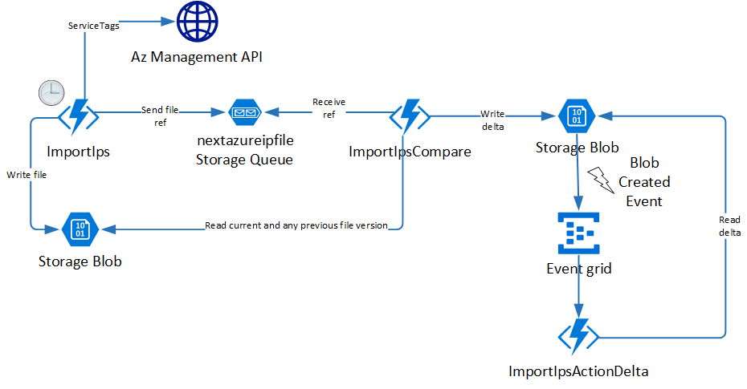

# importazureservicetags

Sample to demonstrate https://docs.microsoft.com/en-us/azure/virtual-network/service-tags-overview#service-tags-on-premises

> [!Note] Different regions have different file versions. The code stores the file by container which is named by the region
